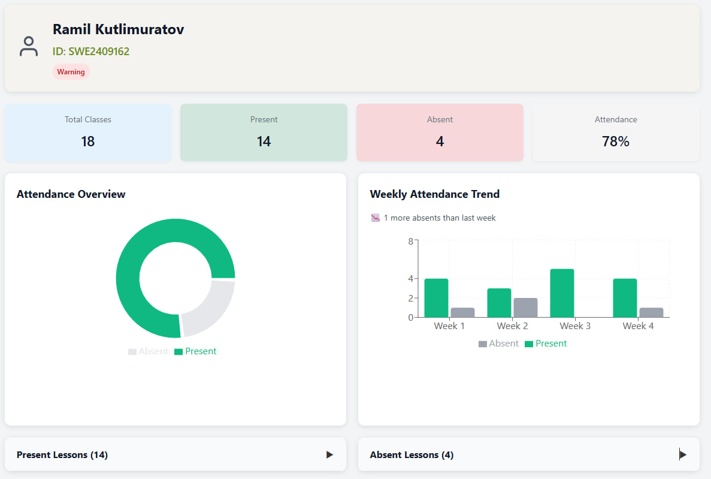

# 🎓 Student Attendance Tracking System – Full-Stack MERN Solution

> Revolutionizing how XMUM students track attendance, academic schedules, and personal records — Built with passion, precision, and modern web technologies.

---

## 🚀 Project Overview

Student attendance plays a critical role in Malaysian universities, particularly for international students where attendance below 80% risks **visa cancellation**. However, students at **Xiamen University Malaysia (XMUM)** face a frustrating process, having to manually email academic departments just to view attendance records.

To solve this real problem, I independently designed, developed, and deployed a **production-ready, full-stack web application** using the **MERN stack**. My solution empowers students with **instant access** to their attendance percentage, class history, academic profile, and a personalized timetable — all through a sleek, mobile-friendly interface.

This system bridges the gap between institutional data and student self-awareness, boosting transparency, ease of use, and engagement.

---

## ✨ Core Features

- 🔐 **Student Login**  
Secure login using Student ID and Full Name (no third-party accounts).

- 📊 **Attendance Dashboard**  
Instantly displays:
  - Total classes attended and absent
  - Percentage of attendance
  - **Interactive Pie Chart** (Present vs. Absent)
  - **Weekly Attendance Trend Bar Chart**
   

- 👤 **Student Profile Page**
  - Name, Country, Email, Emergency Contact
  - Academic Details (Major, CGPA, Year of Study)
  - Clickable Major → Timetable Navigation
    

- 📅 **Digital Timetable + Calendar**
  - Dynamic, filterable weekly class schedule  
  - Calendar shows **only your academic batch** + relevant public holidays  
  - Clean, intuitive presentation unlike outdated PDF calendars
   

- 🌿 **Nature-Inspired UI Design**
  - Calm, vibrant colors (greens, blues, grays, yellows, reds)
  - Designed for readability, comfort, and familiarity for Malaysian students

- 📱 **Fully Responsive + Animated**
  - Mobile-first, touch-friendly design
  - Seamless hover & click animations powered by **Framer Motion**

---

## 🛠️ Tech Stack & Architecture

| Layer           | Technology                                      | Purpose                                   |
|-----------------|-------------------------------------------------|------------------------------------------|
| **Frontend**    | React.js, React Router, Recharts, Framer Motion | UI Components, Routing, Data Visualization, Animations |
| **Backend**     | Node.js, Express.js                             | RESTful API, Authentication, Business Logic |
| **Database**    | MongoDB, Mongoose                               | NoSQL Data Storage (Students, Attendance, Timetables) |
| **Styling**     | CSS, Flexbox, CSS Grid                          | Responsive Design & Layout Control |

---

## 📐 System Design Philosophy

- **User-Centric Design:** Optimized for real students, not just academic demos.
- **Minimal Steps:** All key functions accessible within 2–3 clicks.
- **Visual Hierarchy:** Data is digestible at a glance through charts and structured layouts.
- **Mobile-First:** Seamless experience on phones, tablets, and desktops.
- **Nature-Based Theme:** Inspired by Malaysian landscapes to foster visual comfort.

---

## 📥 Setup Instructions (For Developers)

1. **Clone the Repository**
```bash
git clone https://github.com/Ramilbey/attendance-check-app.git
